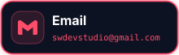
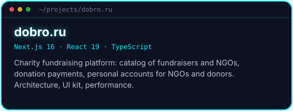
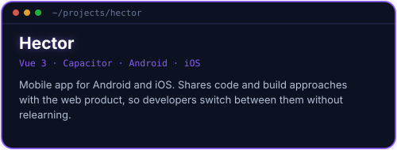
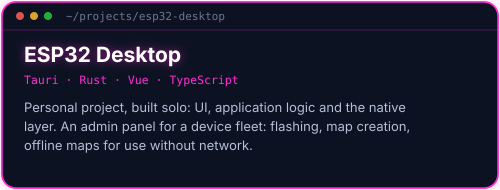
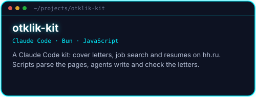

  <a href="README.md">🇷🇺 Русский</a> &nbsp;·&nbsp; <b>🇬🇧 English</b>

  

  
  
  
   
  
  

Frontend developer and team lead. 7+ years of commercial work on Vue/Nuxt and React/Next.js: e-commerce, high-traffic platforms, moving legacy systems to a modern stack.

I currently lead a team of 4 frontend developers and own the architecture of two products: a web platform on Next.js and a mobile app on Vue 3 + Capacitor. I run sprint planning in Jira, code review and onboarding.

Since 2025 I have worked with AI assistants (Claude Code, Codex, Gemini): tests, legacy analysis, debugging. I write skills and rules for them to match project standards and connect MCP servers.

   
   
  

  
  
  
  
  
  
  

**Also:** Zustand, SWR, TanStack Query, Pinia, Vuex, React Hook Form, Zod, Capacitor, Nuxt 2/3/4, SSR/ISR, REST, GraphQL, WebSocket, Clinic.js, autocannon, Lighthouse.

  
  
   
  
  

  
  

